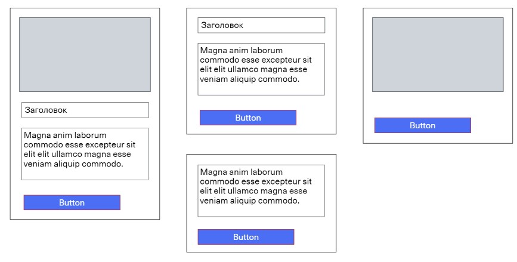
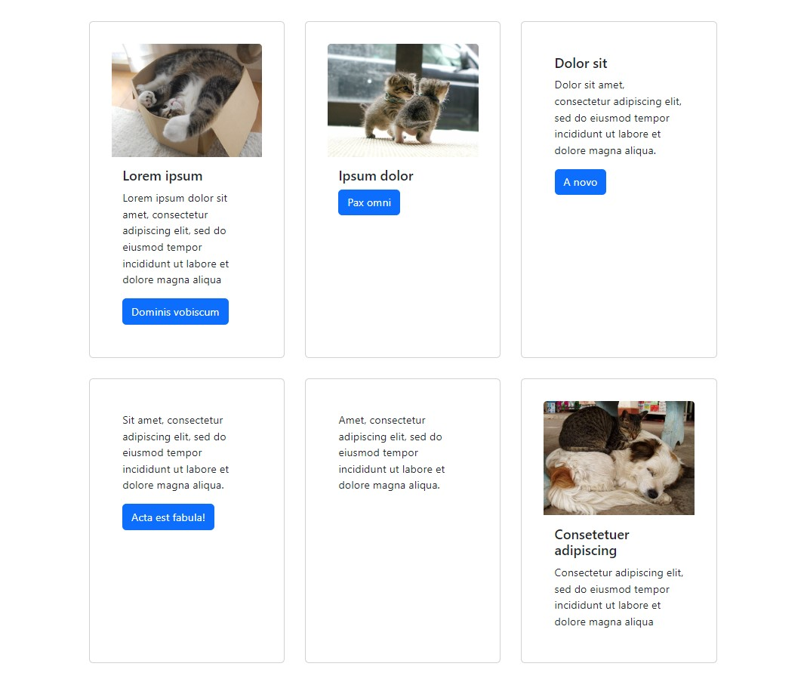

<a name="top"></a>
# Карточки

[вернуться в корневой readme](../README.md)


- [Задание](#задание)
- [Решение](#решение)

## Задание

Вам необходимо реализовать компонент карточек, позволяющий использовать себя следующим образом:  


В качестве CSS вы можете использовать Bootstrap, а подглядеть генерируемую разметку можете на [странице](https://getbootstrap.com/docs/4.3/components/card/)
```html
<div class="card" style="width: 18rem;">
  
  <div class="card-body">
    <h5 class="card-title">Card title</h5>
    <p class="card-text">Some quick example text to build on the card title and make up the bulk of the card's content.</p>
    <a href="#" class="btn btn-primary">Go somewhere</a>
  </div>
</div>
```
В карточке может не быть картинки, заголовка, текста и кнопки.

[Вверх](#top)

## Решение

Bootstrap подключим как статические минимизированные файлы  
https://getbootstrap.com/docs/5.3/getting-started/download/


Предполагаемые варианты наполнения карточки:  



Ощущение, что в коде компонента карточки два грязных трюка (хотя использование Bootstrap это своего рода трюк) - с **cloneElement** и композицией дочерних элементов, но ТЗ визуально выполнено и код смотрится коротким.

Подход с **cloneElement** может снизить производительность приложения, но более стильный и современный подход с передачей пропсов дочерним компонентам через **Context API** мы ещё не знаем. 

Скриншот продукта с разным наполнением карточек:


Я просто оставлю это здесь:
```tsx
/* CardContext.tsx */
import React, { createContext, useContext } from 'react';

type TCard = {
  image?: string;
  title?: string;
  text?: string;
  buttonTitle?: string;
};

const CardContext = createContext<TCard | undefined>(undefined);

export const useCardContext = () => {
  const context = useContext(CardContext);
  if (!context) {
    throw new Error('useCardContext must be used within a CardProvider');
  }
  return context;
};

export const CardProvider: React.FC<{ value: TCard }> = ({ value, children }) => {
  return <CardContext.Provider value={value}>{children}</CardContext.Provider>;
};
```
и  
```tsx
/* CardImage.tsx */
import React from 'react';
import { useCardContext } from './CardContext';

const CardImage: React.FC = () => {
  const { image } = useCardContext();
  return image ?  : null;
};

export default CardImage;
```
и
```tsx
/* Card.tsx */
import React, { PropsWithChildren, FC } from 'react';
import { CardProvider } from './CardContext';

type TCard = {
  image?: string;
  title?: string;
  text?: string;
  buttonTitle?: string;
};

const Card: FC<PropsWithChildren<{ props: TCard }>> = ({ children, props }) => {
  return (
    <CardProvider value={props}>
      <div className="card" style={{ width: "18rem" }}>
        {children}
      </div>
    </CardProvider>
  );
};

export default Card;
```

[Вверх](#top)
