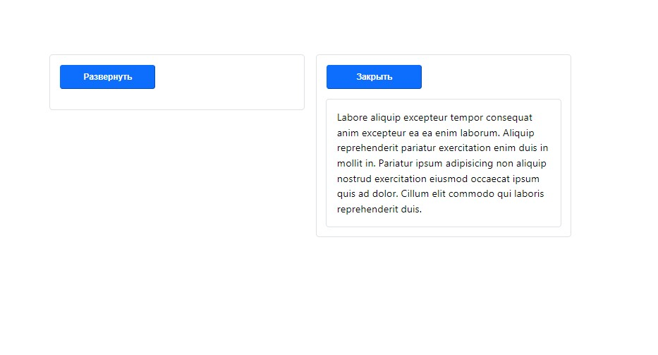

<a name="top"></a>
# Collapse

[вернуться в корневой readme](../README.md)


- [Задание](#задание)
- [Решение](#решение)

## Задание

Вам поручено реализовать аналог компонента [Collapse](https://getbootstrap.com/docs/5.0/components/collapse/#example).  
Компонент выглядит в виде кнопки с расположенным под ним блоком с полезной информацией 

Используйте следующие props:
- collapsedLabel,
- expandedLabel.
Если значения этих props не переданы, то они принимают значения по умолчанию Развернуть (для collapsedLabel) и Свернуть (для expandedLabel).

Попробуйте также реализовать анимацию с помощью CSS.

[Вверх](#top)

## Решение

Реализовал компонент Collapse как обертку для дочерних элементов.  
При клике по кнопке содержимое сворачивается/разворачивается.  
Применена базовая анимация свойств через transition

Пример использования:
```jsx
<Collapse collapsedLabel="Открыть" expandedLabel="Закрыть">
  <p>
    Labore aliquip excepteur tempor consequat anim excepteur ea ea enim
    laborum. Aliquip reprehenderit pariatur exercitation enim duis in
    mollit in. Pariatur ipsum adipisicing non aliquip nostrud exercitation
    eiusmod occaecat ipsum quis ad dolor. Cillum elit commodo qui laboris
    reprehenderit duis.
  </p>
</Collapse>
```

Скриншот решения:  



[Вверх](#top)
