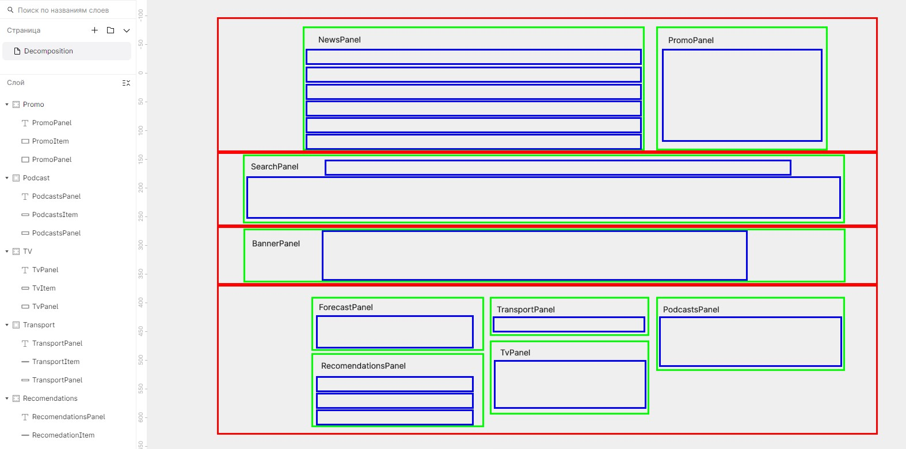

# Декомпозиция

[вернуться в корневой readme](../README.md)

- [Задание](#задание)
- [Решение](#решение)

## Задание

Вы работаете в стартапе, который решил тягаться с самим Яндексом в части предоставления контента. Это, конечно же, шутка, но задача нешуточная.

Вам принесли дизайн-макет, похожий на этот:

 

Что вам нужно сделать:

1. Разбейте весь интерфейс на компоненты и в файле каждого компонента напишите буквально одну строку комментария, за что данный компонент отвечает. Можете использовать формат JSDoc, детали про него можно посмотреть по [ссылке](https://react-styleguidist.js.org/docs/documenting/). Также рекомендуем [статью](https://medium.com/@antonkrinitsyn/jsdoc-react-5e6c530880a0) на тему JSDoc.
2. Постарайтесь повторяющиеся компоненты сделать настраиваемыми за счёт props. Допустим, у каждой новости в списке новостей: иконка, текст и ссылка.
Функциональность и стилизацию реализовывать не нужно, достаточно базового оформления, чтобы видно было все блоки.

[Вверх](#top)

## Решение

Разбиение видится примерно так:  

Виджеты ниже баннера вообще выглядят так, как будто используют один компонент с управляемой шириной, в который передаются заголовок и данные.

Создал в компонентах, как понял, разметку для JSDoc 

[Вверх](#top)